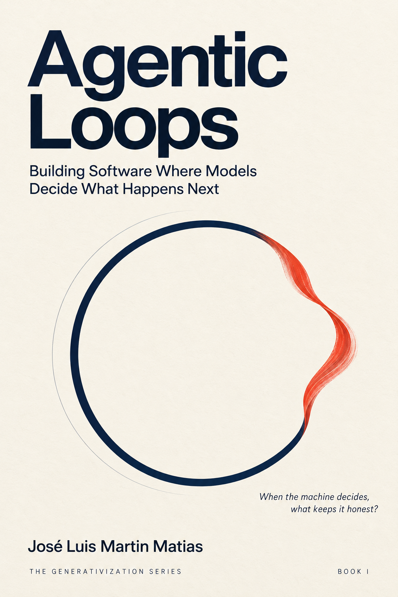

# Agentic Loops

### Building Software Where Models Decide What Happens Next

*Book I of The Generativization Series, by José Luis Martin Matias.*



> **When the machine decides, what keeps it honest?**

For fifty years, software worked because somebody wrote down what should happen
next. That assumption is dissolving. When a model decides the next step, the
old guarantees, the ones that came free from control flow you could read, stop
arriving on their own, and every failure that follows is a failure of
engineering rather than of intelligence. *Agentic Loops* is the field manual
for that new machine: how it decides, what it may touch, what it remembers,
when it stops, how it fails, what it costs, and how you prove it did the right
thing. Thirteen chapters, each opening on a true story, from the alarm that
almost aborted the Moon landing to the airline that argued its chatbot was a
separate legal entity. Thirteen labs, all of them runnable, none of them toys.
One system, built from nothing to production, in the open.

**The book in one sentence:** determinism does not disappear when software
generates its own behavior. It relocates, out of the code you wrote, into the
guarantees you keep.

## Read two chapters here

This repository holds two complete sample chapters, the labs that go with them, and the book's reference runtime.

| # | Chapter | Anchor story | |
|---|---|---|---|
| 1 | One Small Step | Apollo 11, the 1202 alarm | [Read it](chapters/01-one-small-step.md) |
| 2 | The Ghost in the Loop | ELIZA, 1966 | [Read it](chapters/02-the-ghost-in-the-loop.md) |
| 3 | What the Machine Knows | Mars Climate Orbiter | full book |
| 4 | The Art of the Next Move | John Boyd and the OODA loop | full book |
| 5 | A Field Guide to Loops | AutoGPT, spring 2023 | full book |
| 6 | Prompts Are Policies | Air Canada tribunal, 2024 | full book |
| 7 | The Instruction Set | Jacquard's loom, 1804 | full book |
| 8 | Working Memory | Patient H.M. | full book |
| 9 | The Exoskeleton | The atmospheric diving suit | full book |
| 10 | Knowing When to Stop | The Sorcerer's Apprentice; Turing | full book |
| 11 | When Loops Go Wrong | Knight Capital, 2012 | full book |
| 12 | Trust, but Verify | The dollar Chevy Tahoe, 2023 | full book |
| 13 | The Price of a Thought | The 20-watt brain | full book |
| Coda | The Agent Is Still Frozen | names `G(actor)` | full book |

Chapter 1 takes the classical loop apart and builds one you can trust. Chapter
2 replaces one line of it with a model and shows what that single change costs.
Together they are the book's argument in miniature; the other eleven chapters
build the machinery that pays for it.

## Run the labs

Every chapter of the book ends with a lab. The labs for the two chapters
published here are included in full, together with the reference runtime from
Appendix A, the file every chapter builds toward. The labs for the other
chapters ship with the book. Nothing here needs an API key or a third-party
package. The model in each one is a deterministic stand-in behind
the same interface a real model uses, which is why the output printed in the
book is the output you will see on your machine.

```bash
./run_all_labs.sh                              # both labs plus the runtime
python3 labs/ch02_the_ghost_in_the_loop_lab.py # one chapter's lab
python3 meridian_runtime.py                    # the reference runtime
python3 meridian_runtime.py --crash-after 2    # kill mid-run, then resume
python3 meridian_runtime.py --live             # needs ANTHROPIC_API_KEY
```

Python 3.10 or newer is required. Only `--live` needs anything installed:
`pip install -r requirements-live.txt`.

**The experiment to run first:** `--crash-after 2`. Watch the world counters
before and after the crash. They do not change. That is the whole book in two
lines of output.

| Lab | What it shows |
|---|---|
| `ch01_one_small_step_lab.py` | A deterministic loop, then one component that forgets to advance |
| `ch02_the_ghost_in_the_loop_lab.py` | The same loop with a model deciding, and the shell that keeps it honest |
| `meridian_runtime.py` | The book in one file: the reference runtime everything builds toward |

## What the book is about

Put a model inside the loop and the next step stops being something you
wrote. The software still runs. What quietly leaves is everything you never
knew you were getting for free: a control flow you could read, a failure you
could reproduce, a guarantee that held because the code could not do
otherwise.

This book is about getting those guarantees back, deliberately, by hand, as
engineering.

You will build an agent from the ground up: a state that tells the truth about
a moving world, a doorway that admits only well-formed actions, an instruction
set that decides what the machine may touch, a working memory that fits, a
harness that survives being killed mid-task, a stopping stack that knows the
word for enough, a verification ladder that stands between the model's words
and their consequences, and a meter that prices the whole thing before the
invoice does.

Along the way: why the Apollo guidance computer shed work instead of crashing,
why a Canadian tribunal held an airline to its chatbot's invention, why coding
agents got good first, why a $440 million loss took forty-five minutes and no
model at all, and what a man who could not form new memories can teach you
about context windows.

Every chapter ends with a lab that runs. Every lab's output in the book is real.

## Who it is for

Engineers building agents who have discovered that the demo was the easy part.
Architects who have to sign off on a system whose behavior nobody wrote.
Technical leaders who need to say, precisely, what could go wrong and what it
will cost. Prerequisites: comfort reading Python. No machine learning
background required. This is a book about *systems*, not about models.

It is not a prompt-tips book or a framework tutorial. No framework is taught;
the point is the architecture underneath all of them.

## What makes it different

**It is about the shell, not the model.** The industry writes about the model.
The reliability lives in everything around it, and that is what you own, ship,
and improve on your own schedule.

**Every lab runs without an API key.** The model is a port; the book uses a
deterministic adapter so the behavior on the page is the behavior on your
machine. Swap in a live model with five lines when you want the real thing.

**Every anchor story is documented.** Apollo, ELIZA, Mars Climate Orbiter,
Jacquard, Molaison, Knight Capital, Air Canada. No invented anecdotes.

**It has a theory, and the theory earns its keep.** Software evolves by turning
things that were written in advance into things generated at runtime. This
book performs that transformation on exactly one layer, the contents of a
step, and holds the rest still so you can see what it costs.

## The series

- **Book I, Agentic Loops:** the model decides *what happens next*. Sample chapters at [jmartinmatias/agentic-loops](https://github.com/jmartinmatias/agentic-loops).
- **Book II, Generative Agents:** the system decides *who exists to do the work*. Sample chapters at [jmartinmatias/generative-agents](https://github.com/jmartinmatias/generative-agents).
- **Book III, Generative Loops:** the system decides *what computation to run*. Sample chapters at [jmartinmatias/generative-loops](https://github.com/jmartinmatias/generative-loops).
- **Book IV, After Software:** what remains when all three are generated. Sample chapters at [jmartinmatias/after-software](https://github.com/jmartinmatias/after-software).

Each book ends by exposing the next thing still frozen.

## Licenses

The code in this repository (`labs/`, `meridian_runtime.py`, the run scripts,
and the code listings inside the chapters) is released under the MIT License;
see [LICENSE](LICENSE). The prose, including the two sample chapters and this
README, is copyright © 2026 José Luis Martin Matias, all rights reserved; see
[LICENSE-PROSE.md](LICENSE-PROSE.md). You are welcome to read the chapters here
and link to them.

## About the author

José Luis Martin Matias is the author of The Generativization Series. He spent
two decades in fund administration, a corner of finance where software is not
allowed to be approximately right, and the question that world taught him to
ask, where the guarantees go when software stops doing what somebody wrote, is
the question this series exists to answer.
